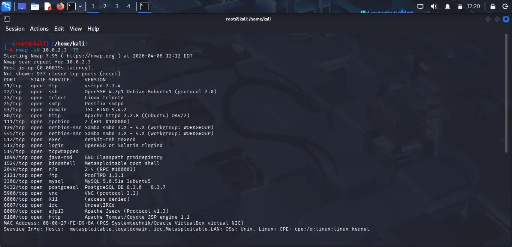
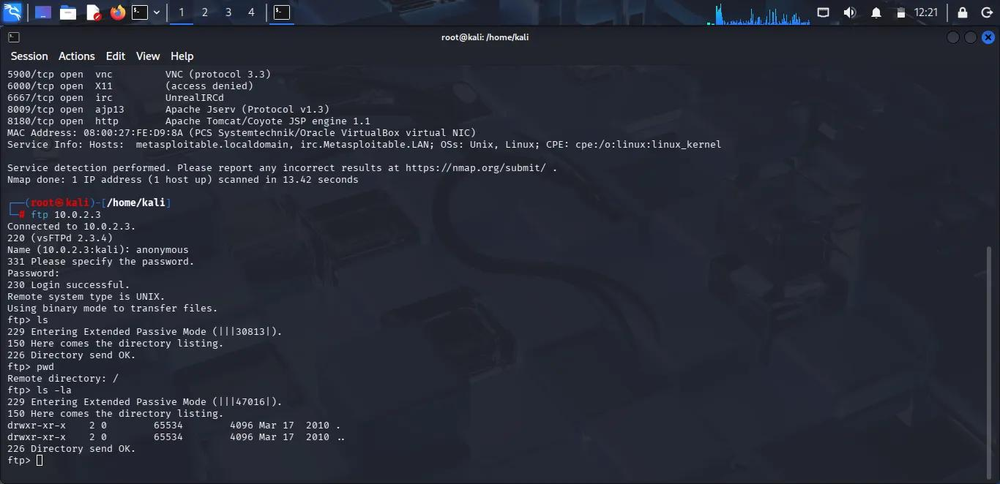

# network-security-lab
Practical network security and penetration testing exercises performed in a controlled lab environment, focusing on real-world scenarios and documentation.
# FTP Access – Metasploitable Lab

## Overview
This project demonstrates a basic penetration testing task in a local lab environment.

## Target
Metasploitable VM (10.0.2.x)

## Tools Used
- Nmap
- FTP

## Steps

1. Performed scan:
   nmap -sV 10.0.2.x

2. Found open port:
   21/tcp (FTP - vsftpd 2.3.4)

3. Connected via FTP:
   ftp 10.0.2.x

4. Logged in using:
   Username: anonymous
   Password: blank

5. Listed directories successfully

## Result
Gained access to FTP service.

## Evidence

### Nmap Scan

### FTP Login

## Conclusion
FTP service allows anonymous login, which is a security misconfiguration.

## Note
All actions were performed in a controlled lab environment.

Readme üçün bu necədir
